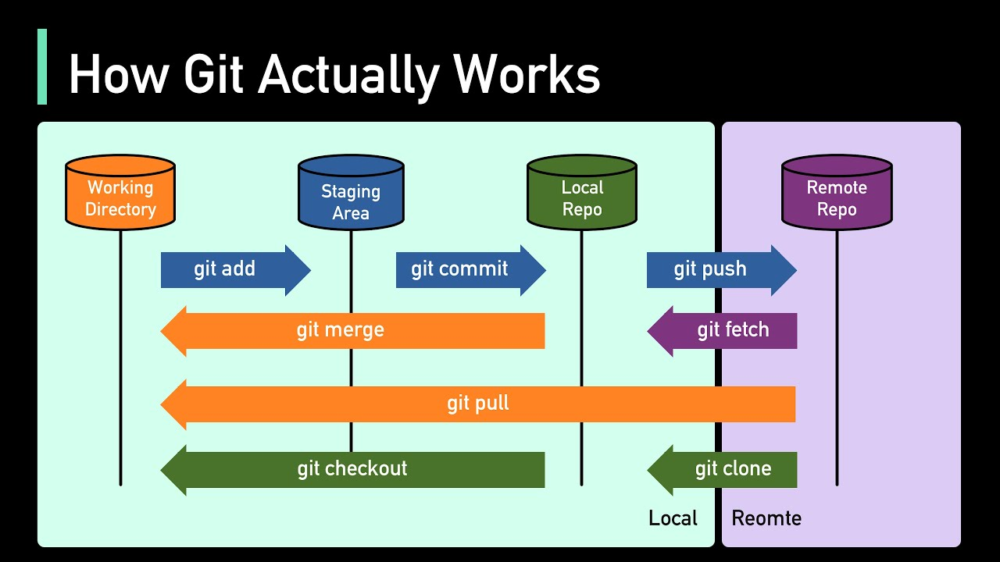

# Guía de uso de Git y GitHub

Guía práctica para arrancar y no cagarla con Git y GitHub. Pensada para uso cotidiano, no es un manual exhaustivo.

## 1. ¿Qué es Git?

Git es un sistema de control de versiones: un programa que registra el historial de cambios de un proyecto para que puedas volver atrás, comparar versiones, o trabajar en paralelo con otras personas sin pisarte el trabajo.

En vez de ir guardando copias sueltas de tus archivos ("informe_final.py", "informe_final_v2.py", "informe_final_v2_posta.py"), Git guarda **snapshots** (fotos) de todo el proyecto cada vez que hacés un commit. Cada snapshot queda enlazado al anterior, así se arma una línea de tiempo completa: quién cambió qué, cuándo, y por qué.

Algunas características clave:

- **Es local primero**: todo pasa en tu máquina. No necesitás estar conectado a internet para hacer commits, ver el historial o crear ramas.
- **Es distribuido**: cuando clonás un repo, te llevás una copia completa del historial, no solo los archivos actuales. Si el servidor se cae, cualquiera con una copia local puede reconstruir todo.
- **Las ramas son baratas**: podés crear una línea de desarrollo paralela (una "branch") para probar algo sin tocar el código que ya funciona, y después decidís si lo fusionás o lo tirás.
- **Nada se pierde tan fácil**: casi cualquier estado anterior del proyecto se puede recuperar, aunque hayas hecho commits de por medio.

### Git vs. GitHub

Son cosas distintas y se confunden seguido:

- **Git** es la herramienta que corre en tu computadora y maneja el versionado.
- **GitHub** es un servicio web que aloja repositorios Git en la nube y le suma funcionalidades colaborativas: pull requests, issues, revisiones de código, control de acceso, CI/CD, etc.

Podés usar Git sin GitHub (todo local), pero GitHub sin Git no existe: es una capa arriba.

### El flujo básico, visualmente

Un cambio típico recorre estas etapas hasta quedar publicado en GitHub:



1. Editás archivos en tu **directorio de trabajo**.
2. Con `git add` los marcás como listos para el próximo commit (**staging**).
3. Con `git commit` los confirmás en el **historial local**.
4. Con `git push` los subís al **repositorio remoto** (GitHub), y con `git pull` traés lo que subieron otros.

## 2. Conceptos básicos

- **Git**: sistema de control de versiones. Corre local, en tu máquina.
- **GitHub**: plataforma que aloja repositorios Git en la nube y agrega herramientas colaborativas (issues, pull requests, etc).
- **Repositorio (repo)**: carpeta de tu proyecto con todo el historial de cambios.
- **Commit**: una "foto" del estado del proyecto en un momento dado, con un mensaje que describe qué cambió.
- **Branch (rama)**: línea de desarrollo independiente. La rama principal suele llamarse `main` (antes `master`).
- **Remote**: la versión del repo que vive en un servidor (por ejemplo, GitHub). El remote por defecto se llama `origin`.

## 3. Configuración inicial

Solo hace falta una vez por máquina:

```bash
git config --global user.name "Tu Nombre"
git config --global user.email "tu@email.com"
```

Para ver la configuración actual:

```bash
git config --list
```

## 4. Empezar un proyecto

### Opción A: crear un repo desde cero

```bash
mkdir mi-proyecto
cd mi-proyecto
git init
```

### Opción B: clonar uno existente

```bash
git clone https://github.com/usuario/repositorio.git
```

## 5. El flujo básico de trabajo

Este es el ciclo que vas a repetir todo el tiempo:

```bash
git status              # ver qué cambió
git add archivo.py      # agregar un archivo al "staging"
git add .                # agregar TODOS los cambios
git commit -m "mensaje"  # guardar los cambios como un commit
git push                 # subir los commits al remote
```

Y para traer cambios que hicieron otros:

```bash
git pull
```

### Cómo escribir un buen mensaje de commit

- Modo imperativo: "arregla bug de login", no "arreglé" o "arreglando".
- Corto y claro en la primera línea (menos de 50 caracteres si podés).
- Si hace falta más contexto, dejá una línea en blanco y después el detalle.

## 6. Trabajar con ramas (branches)

Las ramas te dejan trabajar en algo nuevo sin romper el código que ya funciona en `main`.

```bash
git branch                     # ver ramas locales
git branch nueva-rama          # crear una rama
git checkout nueva-rama        # moverte a esa rama
git checkout -b nueva-rama     # crear y moverte en un solo paso
git switch nueva-rama          # forma moderna de moverte de rama
```

Para volver a `main`:

```bash
git checkout main
```

Para traer los cambios de una rama a otra:

```bash
git checkout main
git merge nueva-rama
```

## 7. Ver el historial

```bash
git log                  # historial completo
git log --oneline        # versión resumida, un commit por línea
git log --oneline --graph --all   # con gráfico de ramas
```

## 8. Deshacer cosas

| Situación | Comando |
|---|---|
| Descartar cambios no confirmados en un archivo | `git checkout -- archivo.py` |
| Sacar un archivo del staging (sin perder el cambio) | `git restore --staged archivo.py` |
| Modificar el último commit (mensaje o contenido) | `git commit --amend` |
| Volver a un commit anterior sin borrar historial | `git revert <hash>` |
| Volver un commit anterior borrando historial (¡cuidado!) | `git reset --hard <hash>` |

`git revert` es más seguro que `git reset --hard` porque no borra historial, crea un commit nuevo que deshace los cambios.

## 9. Trabajar con GitHub

### Subir un repo local a GitHub

1. Crear el repo vacío en GitHub (sin README, sin .gitignore).
2. Conectarlo como remote:

```bash
git remote add origin https://github.com/usuario/repositorio.git
git branch -M main
git push -u origin main
```

### Pull Requests (PR)

Es la forma de proponer cambios para que se sumen a la rama principal, típicamente cuando trabajás en equipo:

1. Creás una rama con tu cambio.
2. Hacés push de esa rama a GitHub: `git push origin nueva-rama`.
3. En GitHub, abrís un "Pull Request" comparando tu rama contra `main`.
4. Alguien (o vos mismo) revisa y aprueba.
5. Se hace merge del PR.

### Fork

Es una copia de un repo ajeno en tu cuenta. Se usa para contribuir a proyectos donde no tenés permisos de escritura directos: forkeás, hacés cambios en tu copia, y después abrís un PR desde tu fork hacia el repo original.

## 10. .gitignore

Archivo para decirle a Git qué carpetas o archivos NO tiene que trackear (por ejemplo entornos virtuales, archivos de configuración local, datasets pesados).

Ejemplo típico para un proyecto de Python:

```
__pycache__/
*.pyc
.venv/
.env
*.csv
.ipynb_checkpoints/
```

## 11. Conflictos de merge

Pasan cuando dos ramas modificaron la misma línea de un archivo de forma distinta. Git no puede decidir solo y te lo marca así:

```
<<<<<<< HEAD
tu versión del código
=======
la otra versión del código
>>>>>>> nueva-rama
```

Hay que editar el archivo a mano, dejar la versión final que quieras, borrar esas marcas (`<<<<<<<`, `=======`, `>>>>>>>`), y después:

```bash
git add archivo-en-conflicto.py
git commit
```

## 12. Comandos que vas a usar todo el tiempo (resumen)

```bash
git status
git add .
git commit -m "mensaje"
git push
git pull
git checkout -b rama-nueva
git log --oneline
```

## 13. Tips generales

- Commiteá seguido y en pedazos chicos: es más fácil entender qué pasó y revertir si algo sale mal.
- Nunca subas contraseñas, tokens ni claves de API a un repo (ni siquiera en un commit viejo — quedan en el historial).
- Antes de un `git push --force`, pensalo dos veces: puede pisar el trabajo de otros.
- `git status` es tu mejor amigo, usalo todo el tiempo para saber en qué estado estás parado.
